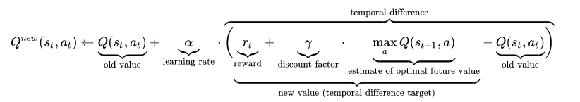
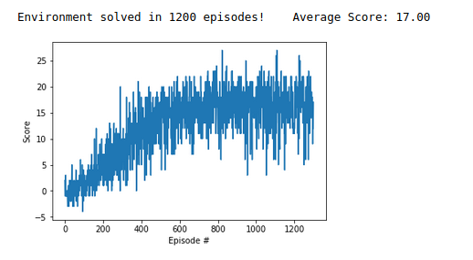

[//]: # (Image References)

[image1]: https://user-images.githubusercontent.com/10624937/42135619-d90f2f28-7d12-11e8-8823-82b970a54d7e.gif "Trained Agent"

#  Navigation

### Introduction

We have trained an agent to navigate (and collect bananas!) in a large, square world.  

![Trained Agent][image1]

A reward of +1 is provided for collecting a yellow banana, and a reward of -1 is provided for collecting a blue banana.  Thus, the goal of your agent is to collect as many yellow bananas as possible while avoiding blue bananas. The agent is trained if it is able to receive an average reward (over 100 episodes) of at least +13. We trained the agent to recieve an average score of `17`!

#### Environment
The state space has 37 dimensions and contains the agent's velocity, along with ray-based perception of objects around agent's forward direction.  Given this information, the agent has to learn how to best select actions.  Four discrete actions are available, corresponding to:
- **`0`** - move forward.
- **`1`** - move backward.
- **`2`** - turn left.
- **`3`** - turn right.

The task is episodic, and in order to solve the environment, your agent must get an average score of +13 over 100 consecutive episodes.

### Learning Algorithm 

Double Deep-Q Learning along with experience replay methods were used to solved this environment.

First a vanilla DQN(Deep Q Network) is discussed followed by the description of one of the way to improve it:Experience Replay. Still, some inherent drawbacks of DQNs are highlighted and finally Double Deep Q Learning method is presented. 

#### Q Learning

For any Finite MDP, Q Learning finds an optimal policy that maximizes the expected sum of rewards. 

Q-Learning algorithm maintains a table for each action value pair and hence its suitable for small environments with limited action space. Before learning, Q-table is initialized to a small random values. The algorithm is based on the Bellman equation as a simple value iteration update, where old values are updated as the weighted average of old value and new information.




#### Deep Q Learning

Since, the state space was large (37^4), we had to use a neural network to map observations(states) to appropriate actions. The neural network with three hidden units were used.

Instead of a tabulated form, each state-action pairs were approprimated with a nonlinear function. However, Reinforcement learning is known to be unstable or even to divergewhen a nonlinear function approximator such as a neural network isused to represent the action-value (also known as Q) function.

One of the causes of this instablility stems from the correlations present in the sequence of observations, which can be mitigated with experience replay.

#### Experience Replay

The act of sampling a small batch of tuples from the replay buffer in order to learn is known a experience buffer. In addition to removing harmful correlation, experience replay allow us to learn from individual tuples multiple times.

#### Double Q-Learning

However,since Deep Q Learning with Experience Repay method uses the same value both to select and evaluate an action, it overestimates the Q-value, especially during the early stages. Therefore Double Deep Q Learning algorithm addresses this issue by decoupling the selection from evaluation.

However, note that selection of action were done from the online weights.

A high level algorithm Double DQN Approach is as follows,
1. Select a tuple from the experience memory bank.
2. Using online network, determine the best next action.
3. Using the target network, from next state determine the index of best next action.
4. Occationally copy the weights from online network to target network.

```python
    def learn_ddqn(self, experiences, gamma):
        #double deep q learning
        #1
        states, actions, rewards, next_states, dones = experiences 
        
        #2
        best_action_arg = self.Q(next_states).detach()
        a_best = best_action_arg.max(1)[1]

        #3
        Q_targets_next = self.Q_dash(next_states).detach().gather(1,a_best.unsqueeze(1))
        Q_targets = rewards + (gamma * Q_targets_next * (1 - dones))
        
        Q_expected = self.Q(states).gather(1, actions)
        # Compute Loss
        loss = F.mse_loss(Q_expected, Q_targets)
        # Minimize the loss
        self.optimizer.zero_grad()
        loss.backward()
        self.optimizer.step()
        #4
        self.soft_update(self.Q, self.Q_dash, TAU) 
```


### Hyperparameters

To map state from actions, three layer neural networks were used. 

| Hidden Units |      Number   |
|--------------|:-------------:|
| Hidden 1 is  |  128          |
| Hidden 2 is  |  128          |
| Hidden 3 is  |  64           |


n_episodes=2000 
eps_start=1.0 # Total exploration in the first few iterations
eps_end=0.01 # Less exploration during final iterations
eps_decay=0.995 
BUFFER_SIZE = int(1e5) # Experience Memory Size  
BATCH_SIZE = 64  # Number of memory items to be sampled       
GAMMA = 0.99            
TAU = 1e-3              
LR = 5e-4               
UPDATE_EVERY = 6 # Skip the first 5 frames before adding it to memory.


### Result

The agent recieves an average score of 17 after about 1000 iteration. The figure below shows the improvement of average score over time.



### Improvements

1) Since some experience, with high or low rewards, are more important than others, they are not prioritized with this method. Therefore, Prioritized Experience Replay method could be used.

2) Instead of learning from a tuple of 37 states, we could lean directly from the pixels.
