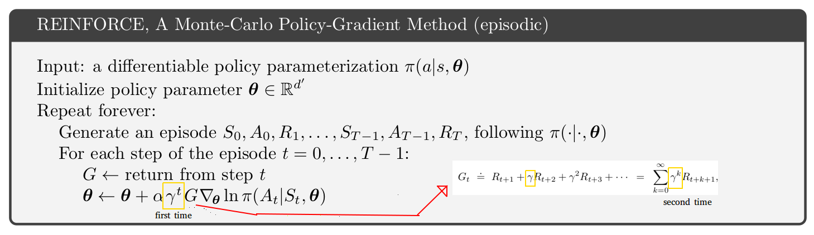
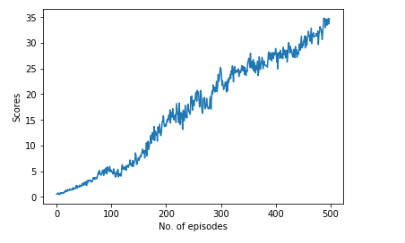

[//]: # (Image References)

[image1]: https://user-images.githubusercontent.com/10624937/43851024-320ba930-9aff-11e8-8493-ee547c6af349.gif "Trained Agent"

# Continous Control

### Introduction

We have trained a double jointed arm to move to a target location. 

A reward of +0.1 is provided for each step that the agent's hand is in the goal location. Thus, the goal of your agent is to maintain its position at the target location for as many time steps as possible.

Real world control task have continous action spaces. One intuitive way to solve the problem is to discretisize the action space. However, since the number of actions increases exponentially with the degree of freedom, such methods, although easy to implement are not viable. 

Therefore we have used a combination of actor-critic approach in Proximal Policy Optimization. According to OpenAI,  Proximal Policy Optimization (PPO), which perform comparably or better than state-of-the-art approaches while being much simpler to implement and tune.

#### Environment

The observation space consists of 33 variables corresponding to position, rotation, velocity, and angular velocities of the arm. Each action is a vector with four numbers, corresponding to torque applicable to two joints. Every entry in the action vector should be a number between -1 and 1. It should be noted that both the action space as well as the state space is continous. 

### Learning Algorithm

#### Policy Gradient, Introduction

Policy gradient methods are fundamental to recent breakthroughs in using deep neural networks for control. Due to their results while working in continous space it is a defacto methods while working in continous space. Policy gradient is mainly an on policy method. It searches actions from current state. 

Basic Policy Gradient method, REINFORCE, is as follows,

However there are many limitations of Vanilla Policy Gradients. First, it is hard to choose a good step size. Since, the inputs are non-stationary, bad steps are too catastrophic for the network. Also, trhere is no clear credit assignment. A trajectory may contain many good/bad actions and wheteher these actions are reinforced depends on the final output. Furthermore, since the algorithm uses a particular trajectory only once, it is quite sample inefficient. 

What if we could  somehow recycle the old trajectories, by modifying them so that they are representative of the new policy?

#### Proximal Policy Method

##### Importance Sampling

In statistics, importance sampling is a general technique for estimating properties of a particular distribution, while only having samples generated from a different distribution than the distribution of interest. Here we will use old trajectories to estimate the gradient for new policies. 

##### PPO, Introduction

PPO uses importance sampling to reuse trajectories ,and KL divergence, which measures the difference between two data distributions p and q, to limit how far we can change our policy in each iteration. PPO adds the divergence penalty as a soft contraint that can be optimized by a first order optimizer, hence its simplicity.  

##### PPO, Discussion

Since we have the approximate form of the gradient, we can think of it as the gradient of a new object, called the surrogate function. So using this new gradient, we can perform gradient ascent to update our policy — which can be thought as directly maximize the surrogate function.

But there is still one important issue we haven’t addressed yet. If we keep reusing old trajectories and updating our policy, at some point the new policy might become different enough from the old one, so that all the approximations we made could become invalid.

We will solve this method using a clipped surrogate function that will stop updating the trajectories when the ratio between the old and low trajectories become bigger than the permissible value.

In short, the PPO algorithm is as follows,

'''
    for iteration 1,2 ... N_Episodes do
        for actor = 1,2, .... N do
            Run policy pi_old for T timesteps
            Compute advantage and returns for all steps
        end for
        Optimize surrogate L wrt theta with K epoches
        update theta_old with theta 
    end for
'''

### Implementation

The learning algorithm used is Proximal Policy Optimization (PPO) modified for continous action space. The input to the neural network model is observation vector (33 real numbers). The model consists of 2 seperate neural networks - actor and critic which are interfaced with one class ActorCritic.

The actor network takes observation as an input and outputs actions. Due to the tanh activation function on the output layer there is no need to scale or clip actions to fit -1, 1 range. The critic network is used to compute advantage returns which requires state value estimation. It outputs 1 real number - state value estimate for the given state.

Action probabilites are taken from the normal distribution.

### Parameters and Hyperparameters

#### Actor Network 

Three fully connected layers

33 input nodes, 4 output nodes and hidden nodes of sizes 256 and 128 in between. 

#### Critic Network 

Three fully connected layers

4 input nodes, 1 output node and hiddent units of sizes 256 and 128 in between.

#### Main hyperparameters

    Discount rate - 0.99
    Tau - 1
    Rollout length - 2000
    Optimization epochs - 10
    Gradient clip - 0.1
    Learning rate - 3e-4
    BATCH_SIZE = 128

### Results

The agent recieves an average score of 30 after about  iteration. The figure below shows the improvement of average score over time.

### Improvements

Hyperparameter tuning - I focused on tuning batch size and rollout length which gave major improvements. Other parameters would probably impact learning and it's worth to check how.

DDPG - Even though DDPG, was achieving comparable results, I gave up on it as it was learning very slowly. But it would be good to see how it actualy compares with PPO on finding the most rewards.

Generalized Advantage Estimate - An exponentially-weighted estimator of advantage function can be used to hit a sweet spot between the desired bias and variance. 
