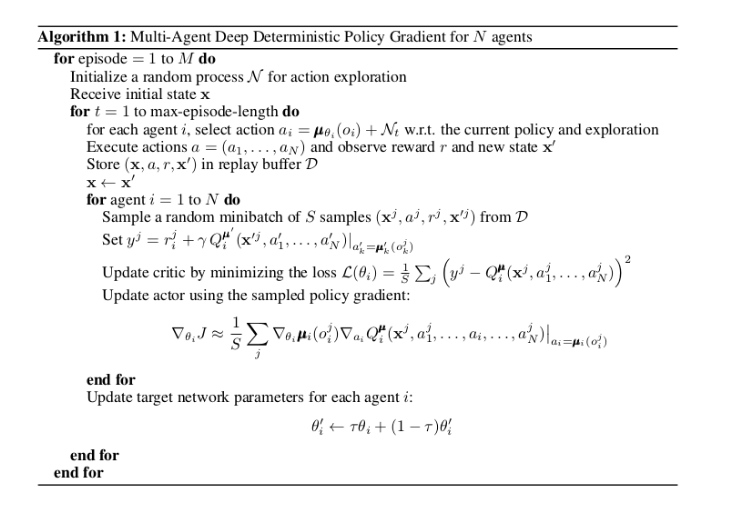
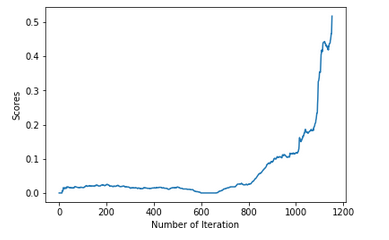

[//]: # (Image References)

[image1]: https://user-images.githubusercontent.com/10624937/42135623-e770e354-7d12-11e8-998d-29fc74429ca2.gif "Trained Agent"

# Project 3: Collaboration and Competition

### Introduction

For this project, we worked with the [Tennis](https://github.com/Unity-Technologies/ml-agents/blob/master/docs/Learning-Environment-Examples.md#tennis) environment.

If an agent hits the ball over the net, it receives a reward of +0.1.  If an agent lets a ball hit the ground or hits the ball out of bounds, it receives a reward of -0.01.  Thus, the goal of each agent is to keep the ball in play. Thus, the goal of the agents is to play legal moves of the game pong for as many time steps as possible.

Multi-agent systems are usually more difficult to train. The difficulty stems from the fact that the environment is non stationary. Q-learning based algorithms usually fail when the environment is not static. Additionally since the number of agent increases the variance of policy gradient algorithms also increases. As designed by the Multi Agent Paper by Rowe et.al, we've adapted actor-critic methods that take a balanced coupled and decoupled approach when training the adversaries.

### Learning Algorithm

As adapted from (Rowe Et.al) , we accomplish our goal by adopting the framework of centralized training with decentralized execution. Similarly, we allow the policies to use extra information to ease training, so long as this information is not used at test time. In other words, during the training process, agents share information via a shared experience-replay buffer. However during the execution step, each agent uses only local observations at execution time.

We extend actor-critic policy gradient method. Here,critic are augmented with policies of all agents, while actor has access only to local information.

We've used a neural network estimator for the actor(to select an action) and critic(to estimate the state-action pairs). As mentioned above, memory buffer is shared among agents to share information during the training process. While selecting the action pairs, we added a uniform random gaussian noise. This noise worked and converged faster with my choice of hyper-parameters. Additionally, for better initial samplings N episodes are executed without training.

To summarize, the MADDPG algorithm work as follows,

## Parameters and Hyperparameters

### Actor Network 

Three fully connected layers

24 input nodes, 2 output nodes and hidden nodes of sizes 256 and 128 in between. 

### Critic Network 

Three fully connected layers

48 input nodes, 4 output node and hiddent units of sizes 256 and 128 in between.

### Main hyperparameters

    LR_ACTOR = 1e-4         # learning rate of the actor 
    LR_CRITIC = 1e-3        # learning rate of the critic
    NOISE_REDUCTION_RATE = 0.99
    EPISODES_BEFORE_TRAINING = 500
    NOISE_START=1.0
    NOISE_END=0.1

## Results

The agent recieves an average score of 0.5 after about 1150 iteration. The figure below shows the improvement of average score over time.

## Improvements

Hyperparameter tuning - I focused on tuning learning rates and EPISODES_BEFORE_TRAINING which gave major improvements. Other parameters would probably impact learning and it's worth to check how.

PPO - Even though DDPG, achieved good results, it would be interesting to test the multi-agent task with PPO.

